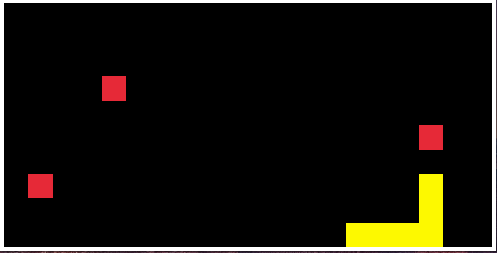

# Compile Lang 2024
A statically typed systems programming language with modern language features such as sum types, generics, and defer for safe resource management.

## Disclaimer
The language design and implementation are not finished. Breaking changes will occur without warning and there are bugs.

## Features
- :white_check_mark: Sum types with pattern matching
- :white_check_mark: `defer` for automatic cleanup of resources
- :white_check_mark: Generics for reusable functions and data structures
- :white_check_mark: Functions, conditionals, loops, and recursion
- :white_check_mark: Compiles to C for portability

## Example Programs
### [Optional](examples/optional.own)
```c
type util import = std.util
type io import = std.io

fn divide(<NumT>)(lhs NumT, rhs NumT) util.Optional(<NumT>) {
    if rhs == 0 => return .none
    return .some(lhs/rhs)
}

fn main() i32 {
    switch divide(8, 2) {
        case .some(num): {
            io.print_str("result is ", "")
            io.print_int(num)
        }
        case .none: io.print_str("error when dividing (cannot divide by zero\n")
    }

    if let .some(num) = divide(6, 3) {
        io.print_str("result is ", "")
        io.print_int(num)
    } else => io.print_str("error when dividing (cannot divide by zero\n")

    return 0
}
```

### [Defer](examples/defer.own)
```c
type coll import = std.collections
type io import = std.io

fn main() i32 {
    let nums coll.Darr(<i32>) = coll.darr_new(<i32>)([94, 23])
    defer coll.darr_free(&nums)

    coll.darr_append(&nums, 3)
    coll.darr_append(&nums, 7)

    for idx usize in 0..nums.count {
        io.print_int(coll.darr_at(nums, idx))
    }

    return 0
}
```
### [Reverse Polish Notation Calculator](examples/calculator.own)
#### start the calculator
```sh
./build/release/main examples/calculator.own -O2 -lm --run
```
#### calculate sqrt(9)*45
```sh
9 sqrt 45 *
```


### [Snake Game](examples/snake_game.own)  

- This example uses raylib. Raylib is not vendored, so it will need to be installed separately and linked manually.
- Example command line to run snake game:
```sh
./build/release/main examples/snake_game.own -O2 /usr/local/raylib-5.5_linux_amd64/lib/libraylib.a -lm --run
```

## Quickstart
1. clone the repo
```sh
git clone https://github.com/jcdufour1/compile-lang-2024.git
cd compile-lang-2024
```
2. build the compiler
```sh
make build
```
3. run a program
```sh
./build/release/main examples/readme_1.own --run
```


